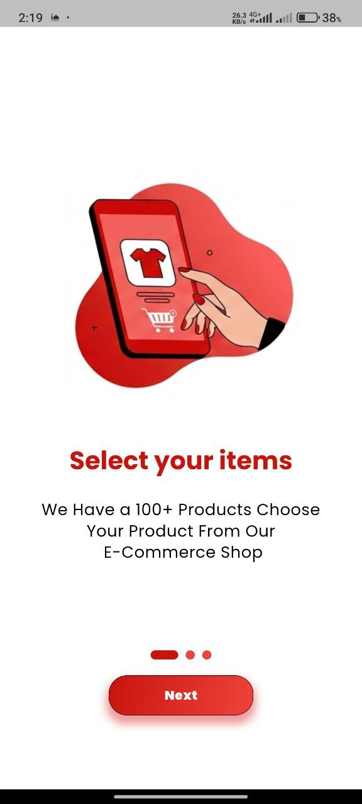
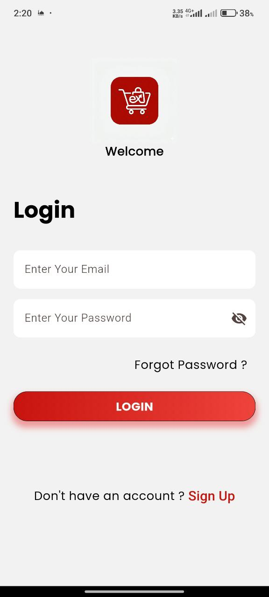
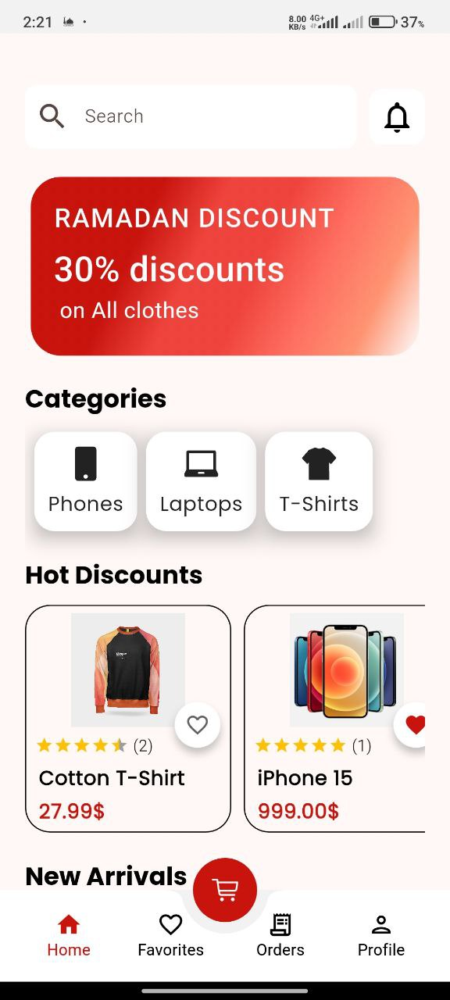
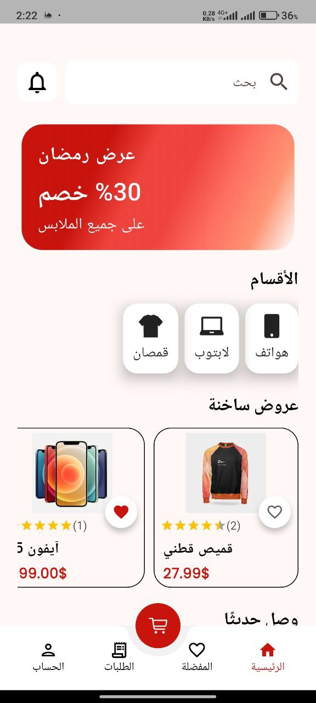
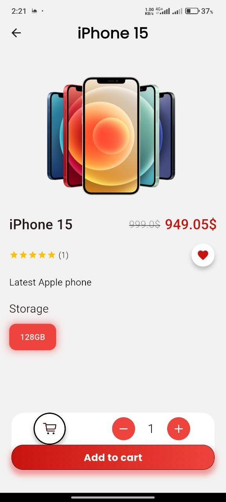

# 🛍️ ShopX — E-commerce App

A full-featured cross-platform e-commerce application built end-to-end,
with an ASP.NET Core REST API backend and a Flutter mobile frontend.

---

## 📱 Screenshots

  
  
  
  
  

---

## ✨ Features

- 🛒 Product browsing & search
- 🧺 Cart management
- 📦 Order placement & tracking
- 🔔 Push notifications (Firebase FCM)
- 🎯 Promotional banners
- 🌐 Bilingual support — English & Arabic

---

## 🛠️ Tech Stack

### Backend
- **Framework:** ASP.NET Core (REST API)
- **Architecture:** DAL / BLL layered architecture
- **Database:** PostgreSQL via Supabase
- **Notifications:** Firebase Cloud Messaging (FCM)

### Mobile
- **Framework:** Flutter & Dart
- **State Management:** BLoC / Cubit
- **Localization:** English & Arabic

---

## 📥 Download

[⬇️ Download APK](https://github.com/YousefAbuHzian/Ecommerce-App/releases/tag/v1.0.0)

---

## 👤 Author

**Yousef Abu Hzian**  
[GitHub](https://github.com/YousefAbuHzian) · [LinkedIn](https://linkedin.com/in/YousefAbuHzian)
